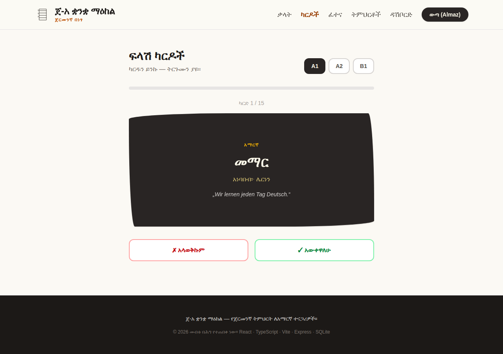

# ጀ-አ ቋንቋ ማዕከል - German-Amharic Language Learning Platform

A full-stack language learning platform that teaches **German to Amharic speakers**. Learners browse a bilingual vocabulary base, drill with flashcards, take auto-generated quizzes, read grammar lessons written in Amharic, and track their personal progress on a dashboard.

Built with **TypeScript end-to-end**: React + Vite on the frontend, Express + SQLite on the backend, shipped as a single Docker container.


## Features

- **📚 Vocabulary browser** — 90+ German words with Amharic translations, Ge'ez-script pronunciation guides, and bilingual example sentences. Filterable by CEFR level (A1–B1), category, and full-text search.
- **🃏 Flashcards** — 3D flip cards per level; every "know / don't know" answer is persisted per user for spaced review.
- **✏️ Quizzes** — server-generated multiple-choice quizzes in both directions (DE→AM and AM→DE) with distractors drawn from the same level; results are stored per user.
- **📖 Grammar lessons** — six markdown lessons explaining German grammar in Amharic (sentence structure, articles, conjugation, Perfekt, cases, introductions).
- **📊 Progress dashboard** — per-level completion bars, accuracy, mastered-word count, weakest words, and quiz history.
- **🔐 Authentication** — JWT-based register/login with bcrypt password hashing; guest users can still browse, drill, and quiz.

| Flashcards | Quiz | Dashboard |
|---|---|---|
|  |  |  |

## Tech stack

| Layer | Technology |
|---|---|
| Frontend | React 18, TypeScript, Vite 6, Tailwind CSS 4, React Router |
| Backend | Node.js 22, Express, TypeScript (ESM), Zod validation |
| Database | SQLite (better-sqlite3, WAL mode), auto-migrated & auto-seeded |
| Auth | JWT (jsonwebtoken) + bcryptjs |
| Deployment | Multi-stage Dockerfile, Docker Compose, health check |

## Architecture

```
├── client/                 # Vite + React SPA
│   └── src/
│       ├── pages/          # Home, Vocabulary, Flashcards, Quiz, Lessons, Dashboard, Auth
│       ├── components/     # Shared layout (header/nav/footer)
│       ├── AuthContext.tsx # JWT session state
│       └── api.ts          # Typed fetch client
├── server/                 # Express REST API
│   └── src/
│       ├── routes/         # auth, vocabulary, quiz, progress, lessons
│       ├── db.ts           # SQLite schema + connection
│       ├── auth.ts         # JWT sign/verify middleware
│       └── seedData.ts     # 90+ vocabulary entries, 6 lessons
├── Dockerfile              # 3-stage build → single ~250 MB runtime image
└── docker-compose.yml
```

In development the Vite dev server proxies `/api/*` to Express (port 3001). In production Express serves the built SPA and the API from one port — one container, no reverse proxy needed.

### API overview

| Method | Endpoint | Auth | Description |
|---|---|---|---|
| POST | `/api/auth/register` | — | Create account, returns JWT |
| POST | `/api/auth/login` | — | Login, returns JWT |
| GET | `/api/auth/me` | ✓ | Current user |
| GET | `/api/vocabulary` | — | List words (`?level=&category=&search=`) |
| GET | `/api/vocabulary/meta` | — | Levels, categories, counts |
| GET | `/api/quiz` | — | Generate quiz (`?level=&count=`) |
| POST | `/api/quiz/submit` | ✓ | Save quiz result |
| GET | `/api/quiz/history` | ✓ | Recent quiz results |
| POST | `/api/progress/review` | ✓ | Record flashcard answer |
| GET | `/api/progress/stats` | ✓ | Dashboard aggregates |
| GET | `/api/lessons` | — | List lessons |
| GET | `/api/lessons/:id` | — | Lesson content (markdown) |

## Getting started

### Local development

```bash
npm install
npm run dev        # Express on :3001 + Vite on :5173 (proxied)
```

Open http://localhost:5173. The SQLite database is created and seeded automatically on first run.

### Production build (no Docker)

```bash
npm run build
npm start          # serves API + built client on :3001
```

### Docker

```bash
docker compose up --build
```

Open http://localhost:3000. The database persists in the `app-data` volume. Set a real secret in production:

```bash
JWT_SECRET=$(openssl rand -hex 32) docker compose up --build -d
```

## Environment variables

| Variable | Default | Description |
|---|---|---|
| `PORT` | `3001` (`3000` in Docker) | HTTP port |
| `JWT_SECRET` | dev fallback | **Set in production** |
| `DATA_DIR` | `./data` | SQLite storage directory |
| `CLIENT_DIST` | `../client/dist` | Built SPA location |
