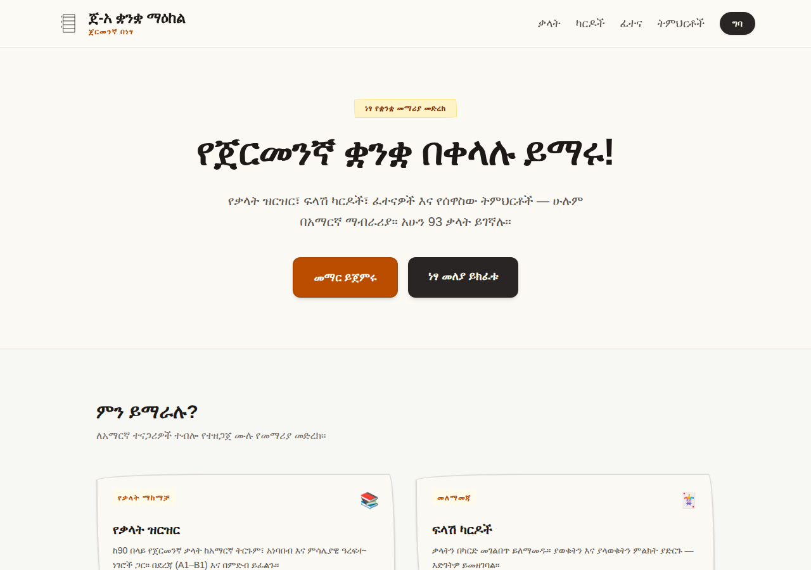
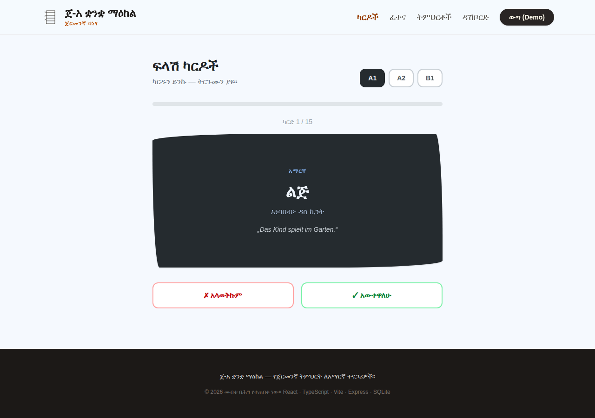
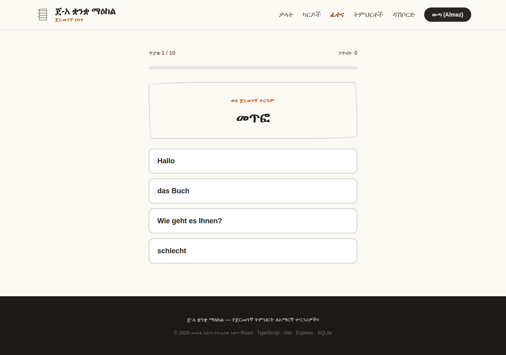
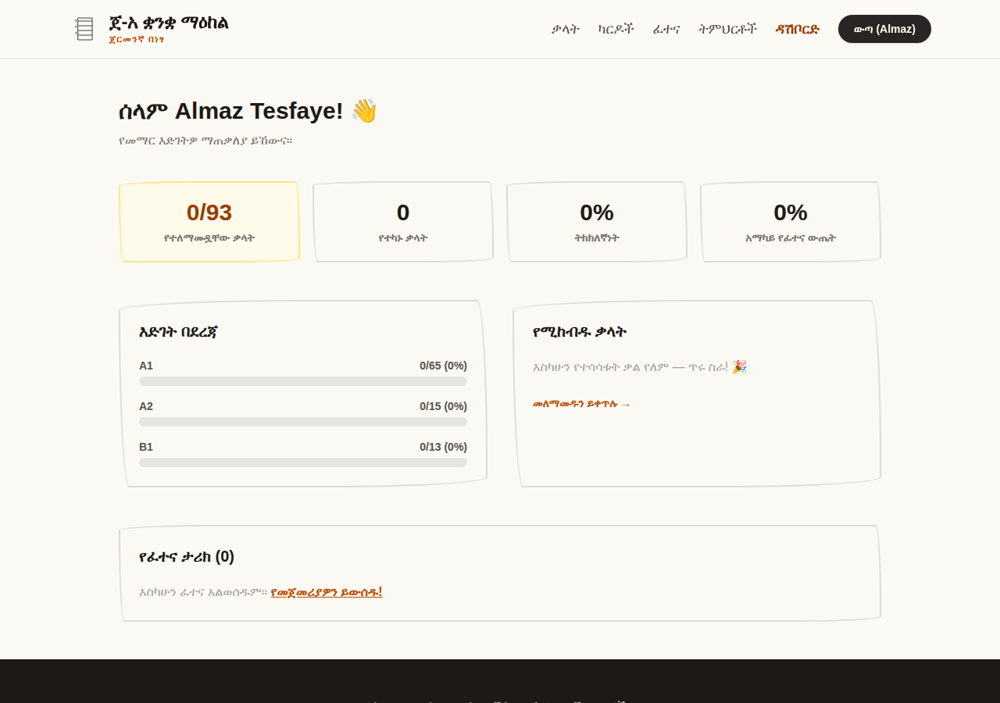
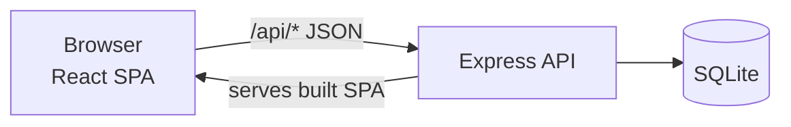

# ጀ-አ ቋንቋ ማዕከል - German-Amharic Learning Platform

A free web app that teaches German to Amharic speakers - flashcards, quizzes, grammar lessons and progress tracking, all explained in Amharic.

[](https://german-amharic-language-learning-website.onrender.com)




## The problem

Thousands of Amharic speakers move to Germany, Switzerland and Austria every year and need to learn German fast - for work, for integration courses, for daily life. Almost every learning resource out there assumes you already speak English: the textbooks explain German grammar in English, the popular apps translate German to English, the YouTube courses are in English.

If Amharic is your language, that is a double barrier. You are forced to learn through a language you may not know, to reach the one you actually need.

This project removes that middle step. German is explained directly in Amharic - the grammar lessons compare German sentence structure to Amharic sentence structure, every word comes with a Ge'ez-script pronunciation guide, and the whole interface is in Amharic.

## Try it live

**https://german-amharic-language-learning-website.onrender.com**

No signup needed - click **Try Demo** on the login page, or use:

| Email | Password |
|---|---|
| `demo@example.com` | `demo1234` |

Hosted on a free tier, so the first load after a quiet period can take up to a minute while the server wakes up.

## Features

**Learning**
- 90+ German words (levels A1-B1) with Amharic translations, pronunciation in Ge'ez script and bilingual example sentences
- Grammar lessons written in Amharic - sentence structure, der/die/das, verb conjugation, Perfekt, Dativ/Akkusativ
- Flashcards with a flip animation - mark each word as known or unknown
- Multiple-choice quizzes in both directions (German → Amharic and Amharic → German), generated fresh on every run

**Tracking**
- Personal dashboard: words practiced per level, accuracy, hardest words, quiz history
- Every flashcard answer and quiz result is stored per user
- Works without an account too - practicing is open to everyone, tracking needs a login

## Screenshots

| Flashcards | Quiz | Dashboard |
|---|---|---|
|  |  |  |

## Tech stack

| Layer | Choices |
|---|---|
| Frontend | React 18, TypeScript, Vite 6, Tailwind CSS 4, React Router |
| Backend | Node.js 22, Express, TypeScript, Zod validation |
| Database | SQLite (better-sqlite3), auto-created and auto-seeded on first start |
| Auth | JWT tokens, bcrypt password hashing |
| Hosting | Render, auto-deploys from `main` on every push |

## Architecture

```
├── client/                 # React SPA
│   └── src/
│       ├── pages/          # Home, Lessons, Flashcards, Quiz, Dashboard, Auth
│       ├── components/     # Shared layout
│       ├── AuthContext.tsx # Session state
│       └── api.ts          # Typed fetch client
└── server/                 # Express REST API
    └── src/
        ├── routes/         # auth, vocabulary, quiz, progress, lessons
        ├── db.ts           # SQLite schema
        ├── auth.ts         # JWT middleware
        └── seedData.ts     # Vocabulary + lessons content
```



In development, Vite runs the frontend with hot reload and proxies `/api/*` to the Express server. In production there is a single server: Express serves the built React app and the API from one port - one process, one deploy.

## API overview

| Method | Endpoint | Auth | Description |
|---|---|---|---|
| POST | `/api/auth/register` | - | Create account, returns JWT |
| POST | `/api/auth/login` | - | Login, returns JWT |
| GET | `/api/auth/me` | ✓ | Current user |
| GET | `/api/vocabulary` | - | List words (`?level=&category=&search=`) |
| GET | `/api/vocabulary/meta` | - | Levels, categories, counts |
| GET | `/api/quiz` | - | Generate a quiz (`?level=&count=`) |
| POST | `/api/quiz/submit` | ✓ | Save a quiz result |
| GET | `/api/quiz/history` | ✓ | Recent quiz results |
| POST | `/api/progress/review` | ✓ | Record a flashcard answer |
| GET | `/api/progress/stats` | ✓ | Dashboard aggregates |
| GET | `/api/lessons` | - | List lessons |
| GET | `/api/lessons/:id` | - | Lesson content |

## Running it locally

Requires Node.js 22 (LTS).

```bash
git clone https://github.com/Timnitt/German-Amharic-language-learning-website.git
cd German-Amharic-language-learning-website
npm install
npm run dev
```

Open http://localhost:5173. The SQLite database is created and seeded automatically - vocabulary, lessons and the demo account included.

Production build:

```bash
npm run build
npm start        # single server on :3001
```

## Environment variables

| Variable | Default | Notes |
|---|---|---|
| `PORT` | `3001` | Set automatically by the host in production |
| `JWT_SECRET` | dev fallback | Set a real secret in production |
| `DEMO_PASSWORD` | `demo1234` | Password for the seeded demo account |
| `DATA_DIR` | `server/data` | Where the SQLite file lives |

## Roadmap

- [ ] Tigrigna and English interface languages, so the platform serves more of the Horn of Africa community
- [ ] Audio pronunciation for every word
- [ ] Spaced repetition - a daily "words due for review" queue instead of random shuffle
- [ ] Docker setup for one-command self-hosting
- [ ] Automated tests and CI pipeline
- [ ] AI grammar coach - ask questions about any German sentence, answered in Amharic

## Author

Built by **Timnit Gebregergis** - [GitHub](https://github.com/Timnitt) · [LinkedIn](https://www.linkedin.com/in/YOUR-PROFILE)

If this project is useful to you or someone learning German, a ⭐ on the repo helps others find it.
